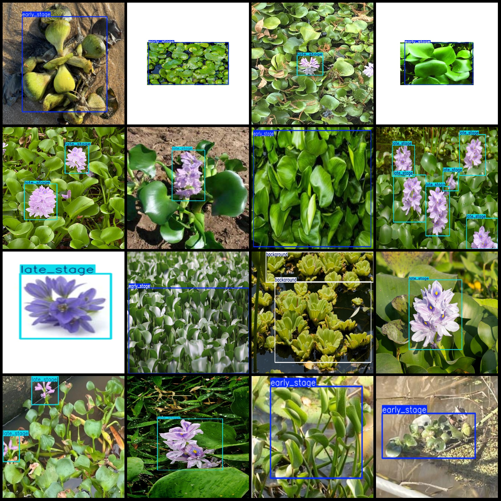
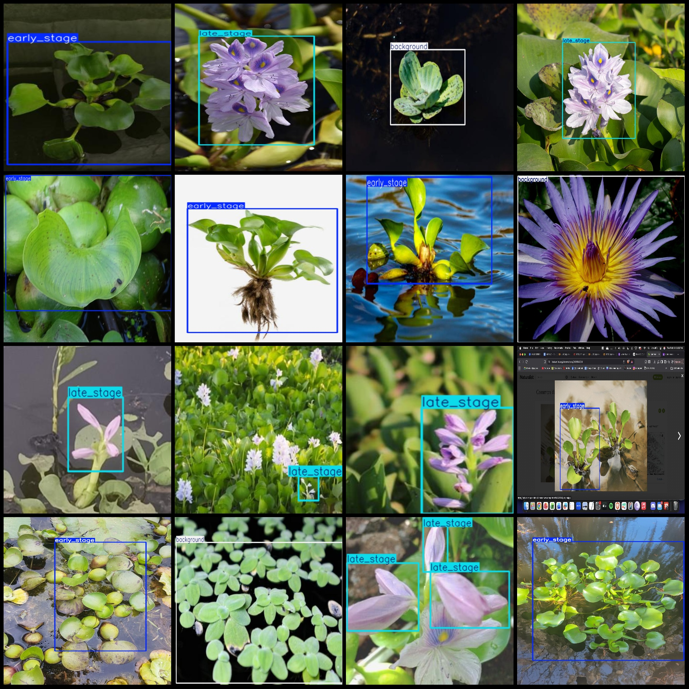

# Water Hyacinth Growth Cycle and Stages Early-Late Detection Data Set in Pascal VOC+YOLO Format with 1029 Images, 3 Categories

Dataset format: Pascal VOC format + YOLO format (txt files without split paths, only containing jpg images along with corresponding VOC format xml files and YOLO format txt files)
Number of images (jpg file count): 1029
Number of annotations (xml file count): 1029
Number of annotations (txt file count): 1029
Number of categories: 3
Annotation category names (note that the order of labels in the YOLO format may not match this, and should be based on the 'labels' folder 'classes.txt'): ["background", "early_stage", "late_stage"]
Number of bounding boxes for each category:
- background (background, to prevent false detection) = 303
- early_stage = 477
- late_stage = 568
Total bounding box count = 1348
Number of images per category:
- background = 234
- early_stage = 399
- late_stage = 400
Image resolution: Multiple resolution images, such as 768x1024, 1024x683, etc.
Annotation tool used: labelImg
Annotation rules: Draw a rectangle around the category.
Important note: The dataset does not have been split into training, validation, or test sets; you will need to do so yourself.
Special declaration: This dataset does not guarantee any accuracy for models trained on it or weight files.
Image preview:
Annotation examples:

## Images

Here is a pay link on Stripe ( https://buy.stripe.com/3cs8yP7sY87d0vu9AB ). Please contact me lonlonago@foxmail.com after funding $89, and I will send you a complete data files , thank you!

